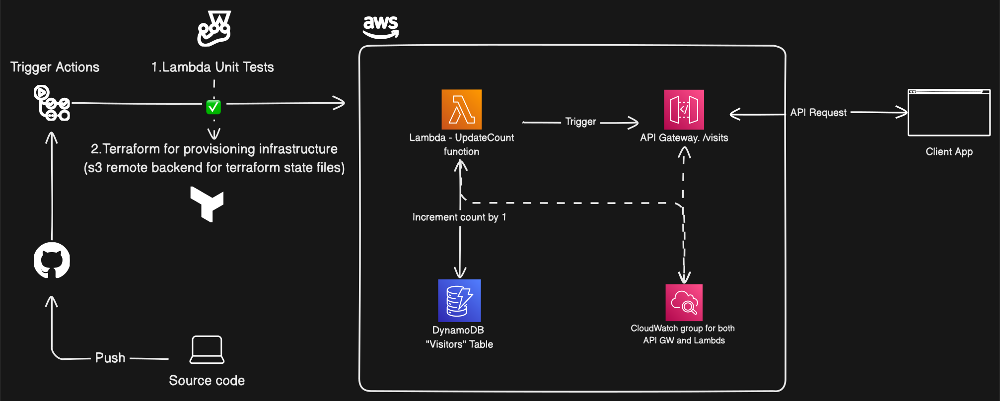
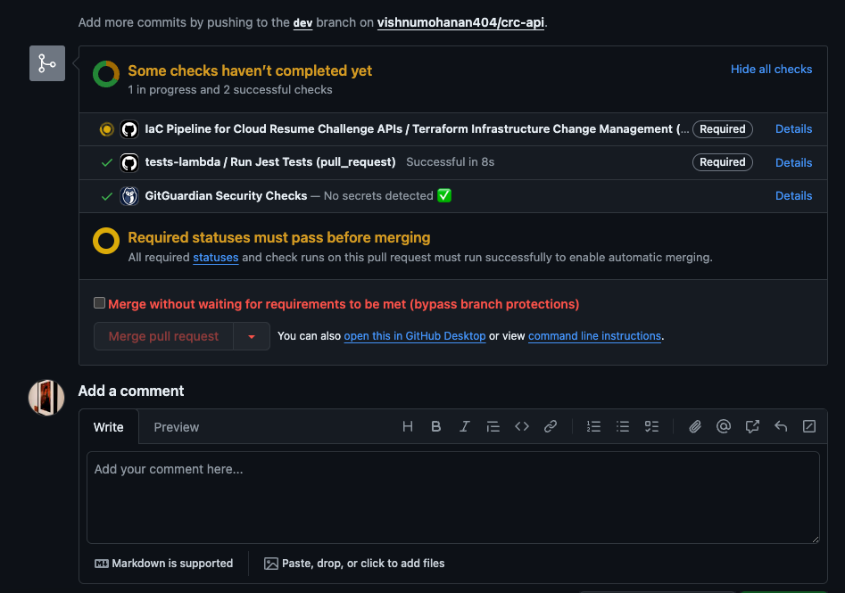

# [Cloud Resume Challenge](https://cloudresumechallenge.dev/docs/the-challenge/aws/) API

This document describes the API built for a portfolio website created using React as part of the Cloud Resume Challenge by [Forrest Brazeal](https://forrestbrazeal.com/). This API serves the purpose of storing and retrieving the total number of visits for my portfolio website.

#### [Client App Repo](https://github.com/vishnumohanan404/crc-portfolio) | [Live](https://vishnuverse.xyz/)

### Goal

The objective of this challenge is to build and deploy a complete portfolio website leveraging the AWS ecosystem. This involves utilizing various cloud solutions and implementing the website from scratch. For this challenge, we'll be using:

1. React app for the front-end deployed using S3 static site hosting
2. Serverless function for retrieving and updating the website view count (using AWS Lambda functions and API Gateway)
3. DynamoDB for data storage

### API Components

The API comprises two Lambda functions written in Node.js:

1. UpdateVisitCount - This function handles both updating and returning the updated visitor count.
2. UpdateVisitCount (Preflight) - This function ensures proper CORS headers for requests made to the UpdateVisitCount API.

### Tools used for the API:

1. Github Actions for CICD
2. Terraform for Infrastructure Provisioning
3. S3 for Terraform backend
4. AWS Lambda for business logic for counter using nodejs
5. AWS API Gateway for triggering Lambda function using HTTP API endpoints
6. Hostinger for DNS and AWS Certificate Manager for HTTPS certification.
7. AWS DynamoDB for data storage
8. Jest for testing the Lambda function
9. AWS CloudWatch for logs

## Architecture Diagram: API Server

### Stages of the Challenge

The Cloud Resume Challenge can be broken down into several logical stages:

1. ### CI/CD - Infrastructure Provisioning and Testing:

- Tools: GitHub Actions, Terraform
- Description: This stage utilizes GitHub Actions to automate the CI/CD pipeline. Terraform defines and manages the infrastructure resources on AWS, including provisioning and testing them before deployment. There is also branch protection rules applied to protect main branch from code which fails the tests.

2. ### Front-end Development and Deployment:

- Tools: React, S3
- Description: Here, the portfolio website's front-end is developed using React. The completed website is then deployed using S3 static site hosting for accessibility.

3. ### API Development and Testing

- Tools: AWS Lambda (Node.js), Jest
- Description: This stage involves developing the two Lambda functions in Node.js: UpdateVisitCount and UpdateVisitCount (Preflight). The Jest testing framework ensures the functionality of these functions before deployment.

4. ### API Gateway Integration and Deployment

- Tools: AWS API Gateway
- Description: API Gateway creates HTTP API endpoints that trigger the Lambda functions developed in the previous stage. This allows external services to interact with the API.

5. ### Data Storage and Management

- Tools: AWS DynamoDB
- Description: DynamoDB serves as the NoSQL database for storing the website visitor count data. This stage ensures proper configuration and data management.

6. ### Security and Monitoring

- Tools: Hostinger (DNS), AWS Certificate Manager, AWS CloudWatch
- Description: Hostinger manages domain name resolution for vishnuverse.xyz. AWS Certificate Manager enables HTTPS for secure communication. Finally, CloudWatch monitors and analyzes logs generated by the Lambda functions and other AWS resources.

### Future Scopes

- Security: Currently, the resources reside in a public subnet. For enhanced security, consider deploying them in a private subnet within a VPC. This restricts access to the resources only through authorized channels.
- High Availability: The current setup doesn't leverage multiple Availability Zones (AZs) for redundancy. Deploying resources across different AZs ensures service continuity even if one AZ encounters an outage.
- VPC Endpoints for DynamoDB Access: Utilize VPC endpoints to enable secure and private communication between the Lambda functions and DynamoDB within the VPC. This eliminates the need for internet gateways and ensures traffic stays within the AWS network.
